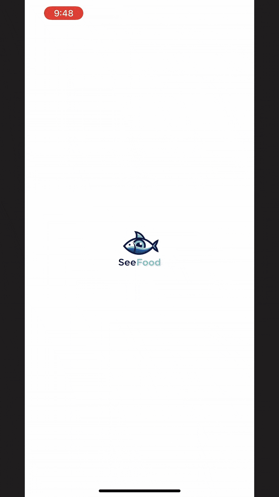

# SeeFood 

Inspired by Jin Yang's app from Silicon Valley, SeeFood is a food classifier trained on Indian food items. 
Its an end to end pipeline with:

- ### SeeFoodModel: 
    - Single Shot Detection with anchor boxes model definitions
    - Model iterations and experiment tracking. 
    - Dataset object for `IndianFoodNet30`
    - Stack: PyTorch, MLFlow

- ### SeeFoodServer: 
    - FastAPI server that runs the PyTorch model.
    - Runs prediction with `base64` encoded image in POST request.
    - Stack: FastAPI, pydantic

- ### SeeFoodModelApp:
    - The mobile app frontent synced with server.
    - Stack: Expo 

## Working Demo

